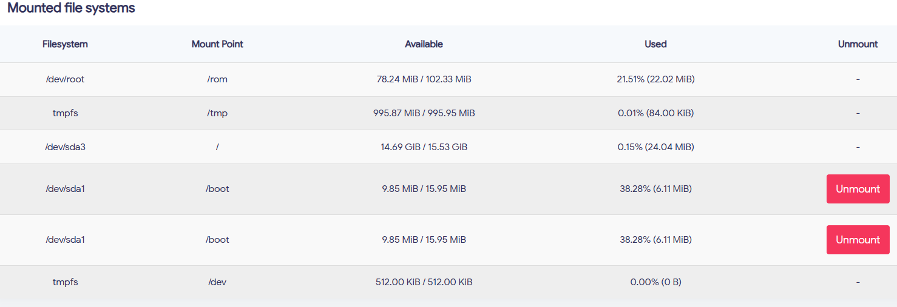

> **其他可选项配置: Optional.md**

# Openwrt 设置
## 首次进入系统
设置 br-lan ip 地址

- `vi /etc/config/network`

  找到 br-lan 部分, 改成你可访问的地址, 例如 192.168.1.10 不与默认的 192.168.1.1 冲突但在同一个子网.
## 进入 openwrt 管理页面
> 个人的一些插件, 可忽略此部分
- 修改源, 比如

```
src/gz openwrt_core https://mirror.tuna.tsinghua.edu.cn/openwrt/releases/23.05.2/targets/x86/64/packages
src/gz openwrt_base https://mirror.tuna.tsinghua.edu.cn/openwrt/releases/23.05.2/packages/x86_64/base
src/gz openwrt_luci https://mirror.tuna.tsinghua.edu.cn/openwrt/releases/23.05.2/packages/x86_64/luci
src/gz openwrt_packages https://mirror.tuna.tsinghua.edu.cn/openwrt/releases/23.05.2/packages/x86_64/packages
src/gz openwrt_routing https://mirror.tuna.tsinghua.edu.cn/openwrt/releases/23.05.2/packages/x86_64/routing
src/gz openwrt_telephony https://mirror.tuna.tsinghua.edu.cn/openwrt/releases/23.05.2/packages/x86_64/telephony
```

- 主题, 比如 luci-app-argon
- others

## 重要: 扩容
进入系统会发现自动分配的根目录很少只有百M级别,会让人恐慌.所以扩容刻不容缓.

1. 准备工具

默认的系统相关软件工具并未安装,例如 fdisk, mount points
- fdisk 可在 System-Software 的软件源中查找, 然后点击 install 即可
- mount points(挂载点) 经查阅[官网文档](https://openwrt.org/docs/guide-user/storage/fstab), 现如下步骤(不考虑 usb 存储介质, 可自行查阅官方)
  1. opkg update
  2. opkg install block-mount
  3. block detect > /etc/config/fstab
  4. service fstab enable

此时, "Mount Points"(挂载点)会出现在 System 设置中

2. 挂载剩余的空间

假设在虚拟机中分配了 16G 大小. 那么此时你运行 `fdisk -l`
```
Disk model: VMware Virtual S
Units: sectors of 1 * 512 = 512 bytes
Sector size (logical/physical): 512 bytes / 512 bytes
I/O size (minimum/optimal): 512 bytes / 512 bytes
Disklabel type: gpt
Disk identifier: 0BF605D0-65DD-058C-3548-B83D11220200

Device       Start      End  Sectors  Size Type
/dev/sda1      512    33279    32768   16M Linux filesystem
/dev/sda2    33280   246271   212992  104M Linux filesystem
/dev/sda128     34      511      478  239K BIOS boot
```
会发现远远不够 16G, 还有许多空间并未挂载. 故使用 fdisk 扩充磁盘
- fdisk /dev/sda
- 进入磁盘管理命令行, 按 "n" add a new partition, 一路确认则创建好 /dev/sda3
- 按 "w" 保存并退出

此时磁盘分区如下
```
Disk /dev/sda: 16 GiB, 17179869184 bytes, 33554432 sectors
Disk model: VMware Virtual S
Units: sectors of 1 * 512 = 512 bytes
Sector size (logical/physical): 512 bytes / 512 bytes
I/O size (minimum/optimal): 512 bytes / 512 bytes
Disklabel type: gpt
Disk identifier: 0BF605D0-65DD-058C-3548-B83D11220200

Device       Start      End  Sectors  Size Type
/dev/sda1      512    33279    32768   16M Linux filesystem
/dev/sda2    33280   246271   212992  104M Linux filesystem
/dev/sda3   247808 33552383 33304576 15.9G Linux filesystem
/dev/sda128     34      511      478  239K BIOS boot
```
3. 创建文件系统
   
   执行命令 `mkfs.ext4 /dev/sda3` 

4. 回到 "Mount Points"(挂载点) 扩容
   - 在 Add 中添加 /dev/sda3,如图所示  作为根文件系统
   - 此时不要急于保存, 先复制 "Root preparation" 所给予的命令, 然后点击右下角保存并应用。
   - **重要** : 更改命令中的 /dev/sda1 为你刚才创建的分区, 此例中为 /dev/sda3,即修改后的命令如下
      ```bash
      mkdir -p /tmp/introot
      mkdir -p /tmp/extroot
      mount --bind / /tmp/introot
      mount /dev/sda3 /tmp/extroot
      tar -C /tmp/introot -cvf - . | tar -C /tmp/extroot -xf -
      umount /tmp/introot
      umount /tmp/extroot
      ```
      回到 ssh 界面, 复制修改后的命令到 openwrt 虚拟机命令行中依次执行.
    - 重启, 此时整个根目录被扩容, 如图所示 

至此, 容量焦虑暂时得到缓解. 记得在 openwrt 中备份设置, 养成良好的习惯.


## 添加用户并启用 sudo

1. shadow 家族软件

```
opkg update
opkg install shadow-xxx
```
这里可能用到的软件
```
shadow-useradd
shadow-userdel
shadow-groupadd
shadow-usermod
shadow-su
sudo
```
1. add user
    1. 可使用 useradd 命令如 linux 中操作 user.
    2. 或者手动添加用户信息, 不需要 useradd 命令

        - 修改 /etc/passwd 末尾添加:
        ```
        yourusername:x:1000:1000:yourgroupname:/home/yourusername:/bin/ash (or "/bin/bash" when using non-offical openwrt)
        ```
        - 同样,添加 /etc/group, /etc/shadow
        ```
        /etc/group: yourusergroup:x:1000:
        /etc/shadow: USER:any:16666:0:99999:7:::
        ```
        - 更改用户密码 `passwd yourusername`
        - 创建 /home/yourusername 用户目录.并修改所属权 `chown yourusername:yourgroupname /home/yourusername`
2. sudo
    - sudo with root password
      
      修改 /etc/sudoers 并 uncomment 
      ```
      Defaults targetpw  # Ask for the password of the target user
      ALL ALL=(ALL) ALL  # WARNING: only use this together with 'Defaults targetpw'
      ```
    - sudo with users's passowrd
      
      添加 yourusername ALL=(ALL) ALL
    - sudo with users passowrd if he is member of group "sudo"
      
      需要安装 shadow-groupadd, shadow-usermod.
      uncomment 
      ```
      ## Uncomment to allow members of group sudo to execute any command
      %sudo ALL=(ALL) ALL 
      ```
      添加 "sudo" group 并将 user 添加到 group "sudo" (可手动在 /etc/group 中添加, 这里使用命令)
      ```
      groupadd --system sudo
      usermod -a -G sudo yourusername
      ```

## WebUI 添加非 root 用户
> :warning: WARNING: untested


- 1 参考链接 [为 OpenWrt 增加用户且开放访问 WebUI 权限](https://www.vvave.net/archives/luci-add-general-login-user-replace-root-in-openwrt.html)
- 2 forum.openwrt [Full solution](https://forum.openwrt.org/t/solved-luci-add-support-user-in-addition-to-root/17402/3)

> Note: change "support" to required user ID
> 
> Full solution:
> - create support user with UID, GUID = 0 (for full access - change to taste)
> - alter /usr/lib/lua/luci/controller/admin/index.lua to read:
"page.sysauth = {"root","support"}" from = "root"
> - alter /usr/lib/lua/luci/controller/admin/servicectl.lua to read:
entry({"servicectl"}, alias("servicectl", "status")).sysauth = {"root","support"} from = "root"
> - NEW: add to /etc/config/rpcd:
config login
        option username 'support'
        option password '$p$support'
        list read '*'
        list write '*'
> - may need to reboot

## 使用 openssh (非必要, 根据习惯)
openwrt 官方镜像默认使用 dropbear 提供的 ssh 功能(适用于小内存设备轻量级ssh), 可在 webui 上直接配置简单方便, 如果想像 linux 一样使用 openssh, 则需要安装新的软件:
- openssh-client(非必要)
- openssh-server

这里直接不使用 dropbear, 在 ui 上 删除 "Dropbear Instance". 在 System/Startup 中 disable dropbear.

然后其他 ssh 操作和在 linux上相同.

## 更改拥塞控制算法
- kmod-tcp-bbr
> 注: 安装完成后自动使用 bbr
> 
> 调度算法保持默认使用 fq_codel 即可
```bash
root@OpenWrt:~# cat /proc/sys/net/ipv4/tcp_available_congestion_control
reno cubic bbr
root@OpenWrt:~# cat /proc/sys/net/ipv4/tcp_congestion_control
bbr
```
